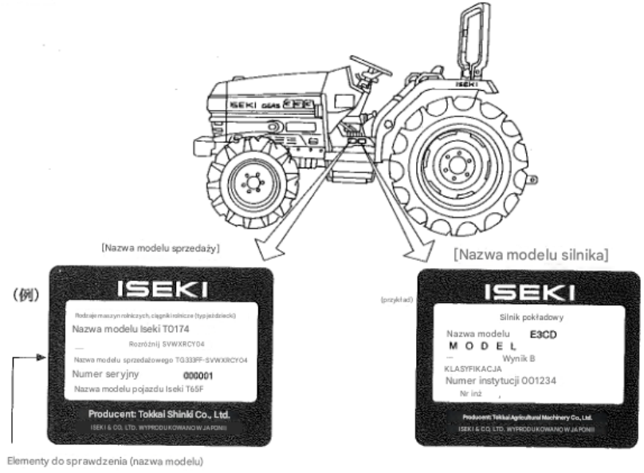

# Dane techniczne

## Podstawowe dane 

Dotyczy Iseki GEAS TG27.

| Nazwa parametru | Wartość | 
| --------------- | ------- |
| Lata produkcji | 1994 - 2004[^1]|
| Masa własna | 1265 kg[^2] :question: |
| Tylny układ zawieszenia narzędzi TUZ | 3 punktowy system zawieszenia kat. 1 |
| Pompa hydrauliczna | 38 l/min |
| Wałek mocy PTO | 4 prędkości, lewo/prawo |
| Skrzynia biegów | Półautomatyczna, 16 biegów przód, 16 biegów tył, rewers |
| Blokada tylnego mostu | Tak |
| Dzielone hamulce | Tak |
| Wspomaganie kierownicy | Tak |
| Asystent skrętu | Tak |

## Tabliczki znamionowe



## Konwencja nazewnicza

```
T G 2 7 3 F F - S V W X R C Y 0 4
    ___ _ ___   _ _ _________ ___
     |  |  |    | |     |      |
     1  2  3    4 5     6      7 
```
1. Moc silnika, np. 27 to 27 HP.
2. Seria 3, w pozostałych przypadkach pole to jest puste np. TG27FF-...
3. Przeniesienie napędu

| Kod | Znaczenie |
| --- | ----------|
| F | Napęd na 4 koła |
| FF | Napęd na 4 koła, wersja dla dużych prędkości (vmax = 25 km/h) |
| NF | Napęd na 4 koła, wersja obniżona (niskopodłogowa) |
| N | Wersja zwężona |

4. Wspomaganie kierownicy

| Kod | Znaczenie |
| --- | ----------|
| W | Wspomaganie kierownicy, synchronizacja liniowa |
| S | Wspomaganie kierownicy, asystent skrętu, półautomat biegów  |
| G | Wspomaganie kierownicy, synchronizacja liniowa, WOM sterowany elektromechanicznie (przyciskami)|

5. Asystent skrętu

| Kod | Znaczenie |
| --- | ----------|
| K | Asystent skrętu |
| V | Asystent skrętu zintegrowany z trybem 4x4 |

6. Wyposażenie maszyny 

| Kod | Znaczenie |
| --- | ----------|
| WX | System elektrohydrauliczny |
| Q | System elektrohydrauliczny, elektrohydrauliczny asystent skrętu :question:, regulacja siły hamowania :question: |
| R | Zablokowany WOM :question: |
| A | Krótki dolny link :question: |
| I | Kabina ROPS z nawiewem powietrza |
| CY | Model z kabiną klimatyzowaną |

7. Ogumienie

| Kod | Znaczenie |
| --- | ----------|
| 02 | Opony o małej szerokości i dużych średnicach |
| 04 | Opony rolkowe :question: |
| 06 | Opony o dużej średnicy |
| 16 | Opony o dużej średnicy |

## Wymiary opon
### Opony przednie
| Model | Kod #7 | Rozmiar opony | Rozstaw osi (mm)|
| ----- | --- | ------------- | ----------------|
| TG23(3) | standard | 6-14 | 960 |
| TG23(3) | 06 | 7-14 | 1090 |
| TG25(3) | standard | 7-14 | 1090 |
| TG25(3) | 06 | 7-16 | 1090 |
| TG27(3) | standard | 7-16 | 1090 |
| TG27(3) | N | 6-12 | 990 |
| TG29(3) | standard | 7-16 | 1090 |
| TG31(3) | standard | 8-16 | 1150 |
| TG31(3) | 16 | 8-16 | 1220 |
| TG33(3) | standard | 8-16 | 1150 |

### Opony tylne
| Model | Kod #7 | Rozmiar opony | Rozstaw osi (mm)|
| ----- | --- | ------------- | ----------------|
| TG23(3) | standard | 9.5-22 | 1010 |
| TG23(3) | 06 | 9.5-24 | 1010 |
| TG25(3) | standard | 9.5-24 | 1010 |
| TG25(3) | 06 | 11.2-24 | 1050 |
| TG27(3) | standard | 11.2-24 | 1050 |
| TG27(3) | N | 9.5-22 | 1010 |
| TG29(3) | standard | 11.2-26 | 1050 |
| TG29(3) | 04 | 12.4-24 | 1050 |
| TG31(3) | standard | 12.4-24 | 1100 |
| TG31(3) | 02 | 11.2-26 | 1060 |
| TG31(3) | 16 | 11.2-28 | 1220 |
| TG33(3) | standard | 13.6-24 | 1100 |
| TG33(3) | 02 | 11.2-28 | 1060 |
| TG33(3) | 04 | 13.6-24 | 1100 |

## Silnik
Parametry dla modelów Iseki GEAS TG 27 i Iseki GEAS TG 273:
| Nazwa parametru | Wartość |
| ----------------| --------|
| Model silnika   | Iseki E4CD |
| Typ             | 3 cylindry, diesel| 
| Chłodzenie      | wodne |
| Pojemność       | 1500 cm3 |
| Moc silnika     | 26.7 hp (19.9 kW)[^2]|
| Obroty znamionowe| 2600 RPM |
| Rozruch         | elektryczny | 
| Instalacja elektryczna| 12 V|

[Następna strona](./02_uwagi_ogolne.md)

[^1]:[TractorData list](https://www.tractordata.com/farm-tractors/tractor-brands/iseki/iseki-tractors.html)
[^2]:[TractorData](https://www.tractordata.com/farm-tractors/009/5/5/9559-iseki-tg273-engine.html)
