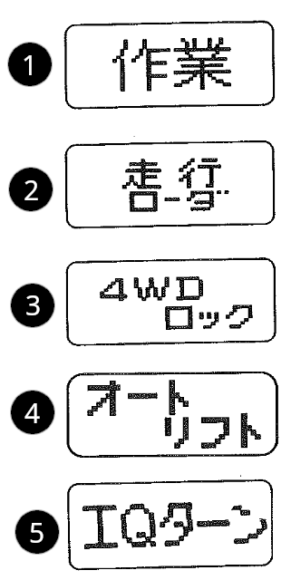
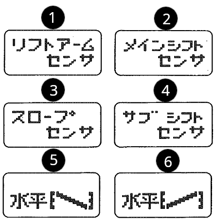

# Uwagi ogólne

## Wstęp

> [!IMPORTANT]
> Podczas jazdy zblokuj lewy i prawy pedał hamulca.

> [!IMPORTANT]
> Przed jazdą upewnij się, że pedał blokady mechanizmu różnicowego jest zwolniony.

> [!IMPORTANT]
> Podczas jazdy po drodze napęd 4x4 powinien być rozłączony (ustawiony w trybie automatycznym).

> [!IMPORTANT]
> Podczas jazdy z dużymi obciążeniami (np. zjazd ze zbocza, praca w polu) nie należy używać przycisków zmiany biegów (półautomat).

## Widok z lewej strony

## Widok z prawej strony

## Widok na TUZ

1. Śruba regulacji cięgna dolnego lewego
2. Wieszak lewy
3. Cięgna dolne
4. Sprężyna naciągu cięgien dolnych 
5. Wałek odbioru mocy (WOM/PTO)
6. Siłownik wieszaka prawego do ustalania poziomu cięgien dolnych
7. Łącznik górny

## Wnętrze

1. Kierownica
2. Dźwignia zmiany biegów rewers 
3. Dźwignia prędkości wałka WOM
4. Dźwignia zmiany pochylenia kolumny kierownicy
5. Pedał sprzęgła
6. Dźwignia zmiany biegów (wybór grupy)
7. Dźwignia zmiany biegów 
8. Siedzenie
9. Skrzynka elektronicznego sterowania hydrauliki
10. Pedał gazu
11. Dźwignia sterująca podnośnika TUZ
12. Pedał hamulca "prawy"
13. Pedał hamulca "lewy"
14. Dźwignia hamulca ręcznego
15. Dźwignia gazu
16. Dźwignia szybkiego sterowania podnosnikiem TUZ

## Wnętrze okolice siedzenia 

1. Skrzynka bezpeczników
2. Blokada sprzęgła (dłuższe postoje, zimowanie, itp)
3. Pas bezpieczeństwa
4. Regulacja pozycji siedzenia
5. Rewers obrotów wałka WOM
6. Blokada mechanizmu różnicowego tylnej osi
7. Regulacja prędkości opadania podnosnika TUZ

## Konsola kierownicy

1. Licznik ciągnika
2. Lampka kontrolna kierunkowskaz lewy
3. Nawiewy powietrza (modele Y, CY)
4. Przełącznik (klakson, kierunkowskazy, światła)
5. Włącznik/przełącznik kierunku WOM (model G)
6. Stacyjka
7. Blokada napędu 4x4 (model V)
8. Przełącznik trybu 2x4/4x4
9. Wyłącznik zatrzymania WOM :question:
10. Wybór prędkości WOM (model G)
11. Zmiana trybu pracy wyświetlacza elektronicznego (modele S, G)
12. Panel lampek sygnalizacyjnych
13. Lampka kontrolna kierunkowskaz prawy

## Widok pod siedzeniem

1. Pokrętło regulacji hamulca
2. Schowek narzędziowy

## Elektroniczna skrzynka sterowania hydrauliki (modele WX, Q)

1. Przełącznik regulacji poziomu cięgien dolnych TUZ
2. :question:
3. Dźwignia sterująca wysokością uniesienia cięgien dolnych TUZ
4. Pokrętło ustalania maksymalnej wysokości uniesienia cięgien dolnych TUZ
5. Pokrętło regulacji pochylenia (dotyczy oryginalnych glebogryzarek Iseki)
6. Przełącznik trybu poziomowania cięgien dolnych TUZ
7. :question:
8. Włącznik trybu automatycznej czułości :question:
9. Regulator głębokości uprawy (siła docisku)
10. Przełącznik automatycznego obciążenia (modele VWX, Q)
11. Przełącznik czułości poziomowania
12. Włącznik automatycznego podnoszenia cięgien dolnych TUZ podczas cofania

## Konsola licznika (modele S, G)

1. Obrotomierz
2. Licznik motogodzin 
3. Wskaźnik temperatury wody
4. Wskaźnik poziomu paliwa
5. Sygnalizator załączonych biegów (model S)
6. Elektroniczny wyświetlacz
7. Wskaźnik trybu 4x4 i asystentu skrętu - IQ4WD (model V)
8. Lampki kontrolne 
   - 1 Podnośnik TUZ - :question: (modele WX, Q)
   - 2 Asystent skrętu (model Q) lub automatyczne podnoszenie podnośnika TUZ (model VWX, patrz 9.14)
   - 3 Automatyczne obciążenie (modele VWX, Q)
   - 4 Zatrzymanie podnośnika TUZ w górnej pozycji (model R)
   - 5 Sygnalizacja rozłączenia hamulców dzielonych
   - 6 Sygnalizacja przeroczenia dopuszczalnej temperatury wody chłodzącej
   - 7 Sygnalizacja utraty ciśnienia oleju w silniku
   - 8 Sygnalizacja braku ładowania akumulatora
   - 9 Praca WOM (modele R, G)
   - 10 Hamulec postojowy (model S)
   - 11 Świece żarowe
   - 12 Asystent sktrętu :question: (model V)
   - 13 Sygnalizacja cofania (modele WX, Q)
9. Lampki kontrolne dla modelu VWX
   - 14 Automatyczne podnoszenie podnośnika TUZ (model VWX)

## Elektroniczny wyświetlacz (modele S, G)

Wyświetlacz służy do sygnalizacji stanu pracy i informowaniu o nietypowych warunkach pracy ciągnika. Zazwyczaj podczas pracy wyświetlana jest prędkość poruszania się pojazdu i prędkość obrotowa wałka WOM jeśli ten jest załączony, dodatkowo wizualizowana jest głębokość np. orki (jest to bardzo poglądowe wskazanie).

Podczas uruchamiania silnika, obsługi przełącznika wyboru napędu na 4 koła lub w przypadku wystąpienia nieprawidłowości w układzie elektrohydraulicznym, odpowiedni komunikat zostanie wyświetlony na wyświetlaczu.

1. Sekcja wizualizacji głębokości opuszczenia TUZ (głębokość orki)
2. Prędkość pojazdu
3. Prędkość obrotowa wałka WOM

### Komunikaty podczas uruchamiania silnika

1. Ekran powitania / brak komunikatów :question:
2. Dźwignia sterująca góra / dół
3. Bieg neutralny (model S)
4. WOM (model G)

### Komunikaty podczas wyboru trybu 4WD (4x4)

1. Praca :question: (model V)
2. Bieg neutralny (model V)
3. Blokada napędu 4x4 (model V)
4. Automatyczna zmiana (model VWX)
5. Asystent skrętu (model Q)

### Komunikaty oznaczające błędy

1. Błąd czujnika podnośnika ramienia (wieszaka) TUZ
2. Błąd głównego czujnika zmiany biegów
3. Błąd czujnika nachylenia (poziomu)
4. Błąd czujnika zmiany biegów
5. Przekroczono maksymalny poziom nachylenia na prawo
6. Przekroczono maksymalny poziom nachylenia na lewo

### Przełącznik wyświetlacza

Gdy ekran wyświetlacza mruga, naciśnij (1) aby przełączyć tryb wyświetlania :question:
