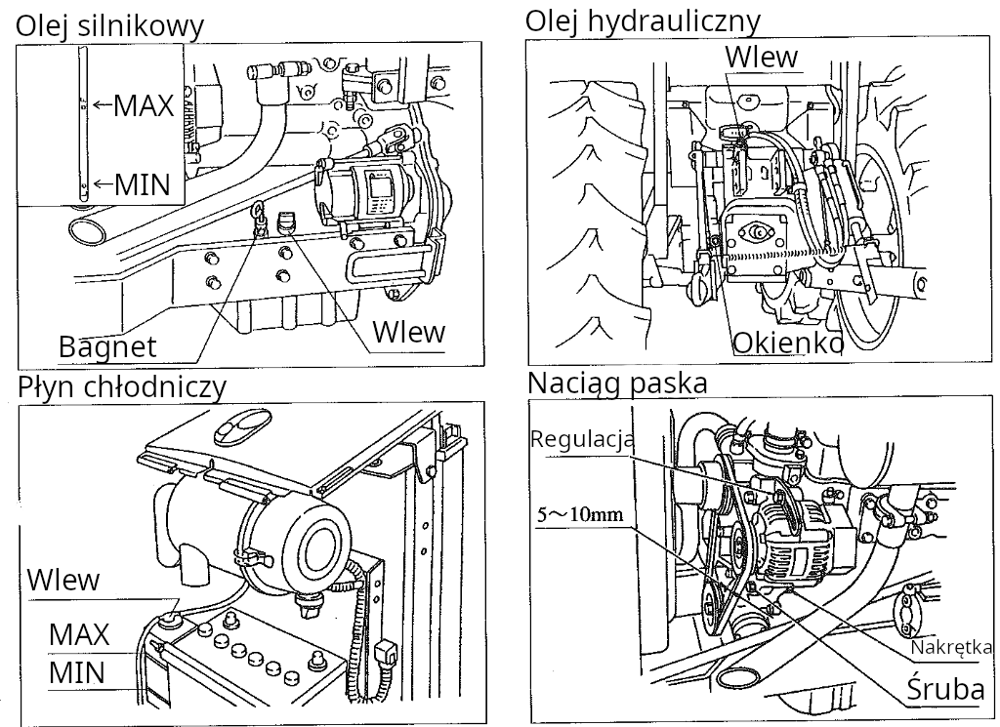
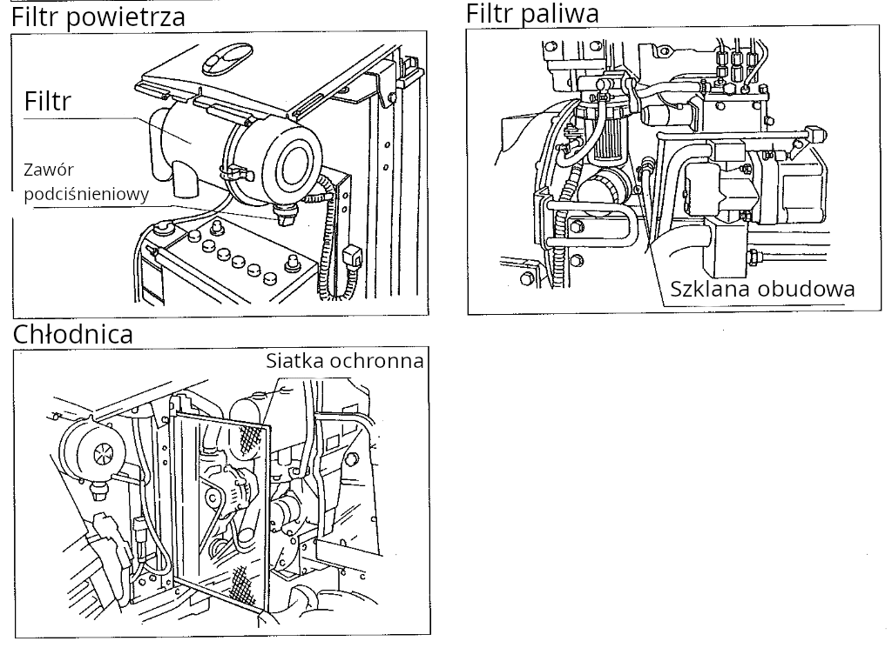

# Eksploatacja 

## Kontrola przed rozpoczęciem pracy

| Kontrola | Jaka czynność |
| -------- | ------------- |
| Wycieki | Sprawdzić czy widoczne są wycieki oleju bądź wody chłodzącej |
| Olej silnikowy | Czy poziom oleju znajduje się pomiędzy górną a dolną granicą |
| Olej hydrauliczny | Czy poziom oleju znajduje się pomiędzy górną a dolną granicą w okienku kontrolnym |
| Woda | Czy poziom wody znajduje się pomiędzy górną a dolną granicą w zbiorniku |
| Pasek wentylatora | Czy pasek nie jest luźny |
| Filtr powietrza | Czy na zaworze próżniowym widoczne są zanieczyszczenia |
| Filtr paliwa | Czy widoczny jest osad bądź woda |
| Chłodnica | Czy siatka ochronna jest czysta |

## Elektryka

### Bezpieczniki

Skrzynka bezpieczników w okolicy pedału sprzęgła, idąc od góry do dołu:

| Wartość | Przeznaczenie |
| ------- | ------------- |
| 10A | Panel licznikowy |
| 15A | Kierunkowskazy, lampy robocze (przód) |
| 15A | Klakson |
| 10A | Lampy tył, światło stop |
| 10A | Automatyka 4x4, asystent skrętu |
| 10A | Elektrohydraulika |
| 5A | Elektrozawór gaszenia silnika |
| 10A | Automatyka skrzyni biegów |
| 5A | Pompa paliwa |

[Następna strona](./04_obsluga.md)
