# Obsługa

## Regulacja kierownicy

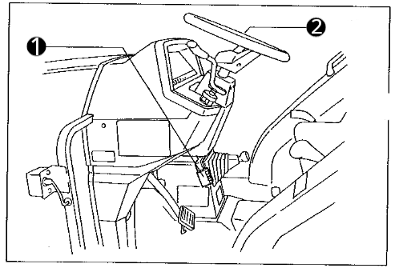

1. Pedał regulacji kierownicy
2. Kierownica

Pozycję kierownicy można regulować w następujący sposób:
- naciśnij pedał regulacji kierownicy
- ustaw kierownicę w wygodnej pozycji
- zwolnij pedał regulacji kierownicy

## Regulacja siedzenia

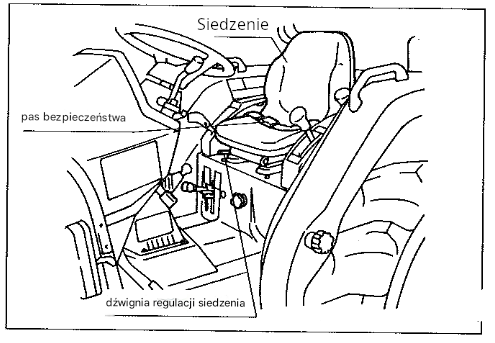

Fotel siedzenia można regulować do przodu bądź do tyłu:

- pociągnij dźwignię regulacji siedzenia do góry
- ustaw fotel siedzenia w dogodnej pozycji
- zablokuj dźwignię regulacji siedzenia

## Przełącznik kombinowany

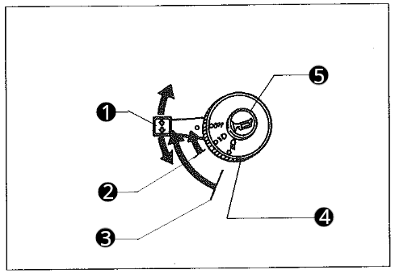

1. Przełącznik kierunkowskazów
2. Pozycja świateł mijania
3. Pozycja świateł drogowych
4. Przełącznik świateł
5. Klakson

## Uruchomienie silnika

### Zaciągnij hamulec ręczny

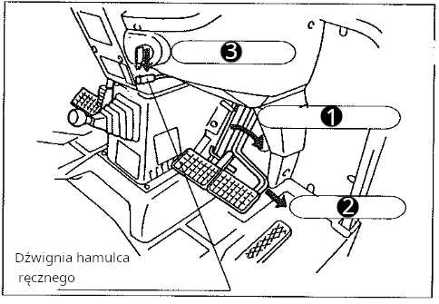

1. Zblokuj hamulce dzielone
2. Naciśnij pedał hamulca
3. Opuść dźwignię hamulca ręcznego

> [!NOTE]
> Ponowne naciśnięcie pedała hamulca zwolni blokadę hamulca ręcznego.

> [!WARNING]
> Jazda z zaciągniętym hamulcem może spowodować uszkodzenie hamulców.

4. Lampka kontrolna hamulca ręcznego powinna się zapalić:

5. Lampka sygnalizująca rozłączenie hamulców dzielonych NIE powinna się palić:

> [!WARNING]
> Podczas jazdy pedały hamulca lewy i prawy powinny być zblokowane. W przeciwnym wypadku hamowanie może doprowadzić do utraty panowania nad pojazdem.

### Opuść podnośnik tylny

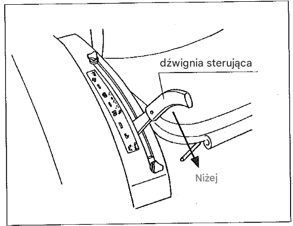

Dla modeli innych niż WX i Q ustaw dźwignię sterującą w najniższej pozycji opuszczają podczepione narzędzie.

### Wałek WOM w pozycji neutralnej

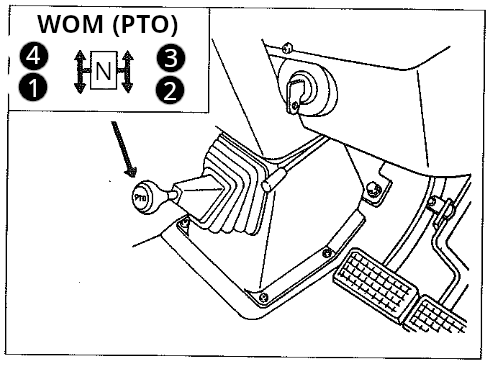
Wałek WOM powinien być ustawiony w pozycji neutralnej N.

> [!IMPORTANT]
> Przed użyciem drążka zmiany obrotów WOM koniecznie naciśnij sprzęgło i poczekaj aż wałek przestanie się obracać. Jeśli WOM jest przyblokowany to naciśnij sprzęgło jeszcze raz.

> [!IMPORTANT]
> Jeśli stacyjka jest w pozycji praca i wałek WOM jest załączony to elektroniczny wyświetlacz powinien to sygnalizować:
>
> 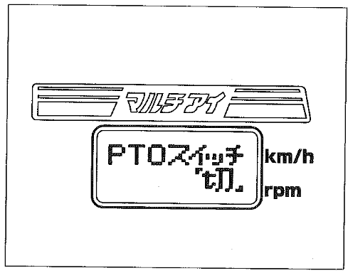
>
> i zapłon nie będzie możliwy.

### Ustaw dźwignię zmiany biegów (rewers) w pozycji neutralnej

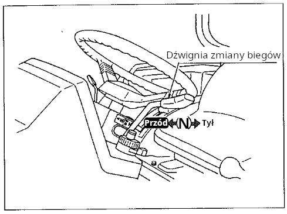

Dźwignia służąca do zmiany biegów do przodu / do tyłu (rewers). Jeśli nie prowadzisz pojazdu, trzymaj ją w pozycji „neutralnej”.

W modelach WX i Q po włączeniu biegu wstecznego włącza się brzęczyk.

W przypadku modelu IQ Shift (S), podczas zmiany położenia z „neutralnego” na „do przodu” lub „wstecz”, podnieś dźwignię raz do góry, a następnie przesuń ją do położenia „do przodu” lub „do tyłu”.

> [!IMPORTANT]
> Dla modeli U i G: Przed użyciem dźwigni zmiany biegów wciśnij sprzęgło. Można używać nawet wtedy gdy ciągnik nie jest całkowicie zatrzymany.

> [!IMPORTANT]
> Dla modelu IQ Shift (S): Można używać dźwigni zmiany biegów bez konieczności wciskania sprzęgła. Uruchomienie pojazdu z dźwignią w pozycji "przód" bądź "tył" nie spowoduje ruchu pojazdu i na elektronicznym wyświetlaczu pojawi się stosowny komunikat. Aby ruszyć należy przestawić dźwignię na pozycję neutralną a następnie wybrać pożądany kierunek.

> [!CAUTION]
> Jeśli ustawiony jest bieg wysoki, to przed zmianą kierunku jazdy zatrzymaj pojazd. Inaczej ryzykujesz uszkodzeniem sprzęgła.

> [!CAUTION]
> Podczas holowania bądź zjazdu z pochyłego terenu unikaj odpalania silnika za pomocą dźwigni zmiany biegów. Używaj sprzęgła.

### Ustaw główną dźwignię zmiany biegów w pozycji neutralnej (model S)

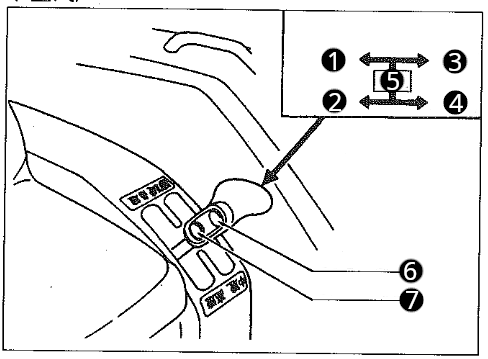

1. Pozycja "biegi pełzające"
2. Pozycja "małe prędkości"
3. Pozycja "średnie prędkości"
4. Pozycja "duże prędkości"
5. Pozycja neutralna
6. Przycisk zwiększenia prędkości o jeden stopień
7. Przycisk zmniejszenia prędkości o jeden stopień

>[!NOTE]
> Przyciski zwiększania lub zmniejszania prędkości można używać bez korzystania ze sprzęgła.

>[!NOTE]
> Przyciskami zwiększania lub zmniejszania prędkości nie da się wybrać biegu neutralnego. Podczas uruchomienia pojazdu zostaje wybrany bieg numer 1.

### Dźwignia przyspieszenia (gazu ręcznego)

Ustaw dźwignię przyspieszenia w połowie zakresu.

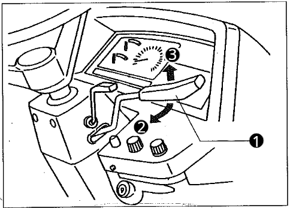

1. Dźwignia przyspieszenia (gaz ręczny)
2. Zwiększanie obrotów
3. Zmniejszanie obrotów

### Wciśnij pedał sprzęgła

> [!IMPORTANT]
> Jeśli nie wciśniesz pedału sprzęgła to zapłon zostanie odcięty.

### Przekręć kluczyk w pozycję praca

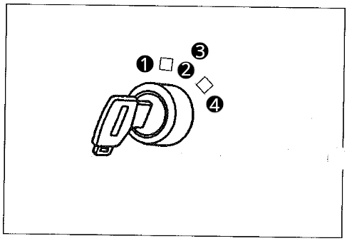

1. Stop. Gaszenie silnika, w tej pozycji można wyciągnąć kluczyk.
2. Praca.
3. Nagrzewanie świec żarowych. Pozycja automatycznie załączana po wybraniu "Praca".
4. Rozruch.

Przekręć kluczyk w pozycję praca. Powinny zapalić się conajmniej dwie lampki kontrolne: brak ciśnienia oleju i brak ładowania akumulatora.

> [!WARNING]
> Po odpaleniu silnika kontrolka braku ładowania powinna zgasnąć. W innym przypadku wystąpił problem z ładowaniem i akumulator może się całkowicie rozładować.

> [!CAUTION]
> Po odpaleniu silnika kontrolka braku ciśnienia oleju powinna zgasnąć. W przeciwnym przypadku natychmiast wyłącz silnik i zdiagnozuj usterkę. W przeciwnym razie może dojść do uszkodzenia silnika.

### Zapłon
Po zgaszeniu lampki żarzenia świec żarowych:

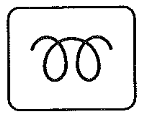

przekręć kluczyk w pozycję "Rozruch".

> [!WARNING]
> Za każdym razem włączaj rozrusznik na maksymalnie około 10 sekund a jeśli silnik się nie uruchomi odczekaj kolejne 10 sekund i ponów próbę.

### Rozgrzewanie silnika

Powoli zwolnij pedał sprzęgła i zacznij proces rozgrzewania silnika. Ustaw obroty na ok 1500 obr/min. W zależności od temperatury otoczenia pozwól silnikowi pracować przez:

| Temperatura otoczenia | Czas rozgrzewki |
| --------------------- | --------------- |
| 0 °C lub więcej | 5 min ~ 10 min |
| 0 °C ~ -10 °C | 10 min ~ 20 min |
| -10 °C ~ -20 °C | 20 min ~ 30 min |
| -20 °C lub mniej | 30 min lub więcej |

> [!WARNING]
> Praca bez rozgrzania maszyny może skrócić żywotność silnika, zatrzeć pompę hydrauliczną lub spowodować awarię ukladu hydraulicznego.

> [!WARNING]
> Olej hydrauliczny w tym traktorku służy również jako olej przekładniowy. W zimne dni, gdy temperatura spada i olej się ochładza, jego lepkość wzrasta, co utrudnia pompie hydraulicznej zasysanie oleju i powoduje hałas w układzie hydraulicznym, dlatego należy pamiętać o podgrzaniu oleju.

> [!WARNING]
> Pamiętaj o zaciągnięciu hamulca ręcznego. Traktor może ruszyć nawet będąc na biegu neutralnym.

[Następna strona](./04_obsluga.md)
