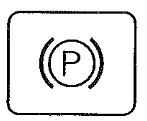
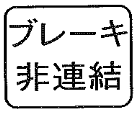

# Obsługa

## Regulacja kierownicy

1. Pedał regulacji kierownicy
2. Kierownica

Pozycję kierownicy można regulować w następujący sposób:
- naciśnij pedał regulacji kierownicy
- ustaw kierownicę w wygodnej pozycji
- zwolnij pedał regulacji kierownicy

## Regulacja siedzenia

Fotel siedzenia można regulować do przodu bądź do tyłu:

- pociągnij dźwignię regulacji siedzenia do góry
- ustaw fotel siedzenia w dogodnej pozycji
- zablokuj dźwignię regulacji siedzenia

## Przełącznik kombinowany

1. Przełącznik kierunkowskazów
2. Pozycja świateł mijania
3. Pozycja świateł drogowych
4. Przełącznik świateł
5. Klakson

## Uruchomienie silnika

### Zaciągnij hamulec ręczny

1. Zblokuj hamulce dzielone
2. Naciśnij pedał hamulca
3. Opuść dźwignię hamulca ręcznego

> [!NOTE]
> Ponowne naciśnięcie pedała hamulca zwolni blokadę hamulca ręcznego.

> [!WARNING]
> Jazda z zaciągniętym hamulcem może spowodować uszkodzenie hamulców.

4. Lampka kontrolna hamulca ręcznego powinna się zapalić:

5. Lampka sygnalizująca rozłączenie hamulców dzielonych NIE powinna się palić:

> [!WARNING]
> Podczas jazdy pedały hamulca lewy i prawy powinny być zblokowane. W przeciwnym wypadku hamowanie może doprowadzić do utraty panowania nad pojazdem.

### Opuść podnośnik tylny

Dla modeli innych niż WX i Q ustaw dźwignię sterującą w najniższej pozycji opuszczają podczepione narzędzie.

### Wałek WOM w pozycji neutralnej

Wałek WOM powinien być ustawiony w pozycji neutralnej N.

> [!IMPORTANT]
> Przed użyciem drążka zmiany obrotów WOM koniecznie naciśnij sprzęgło i poczekaj aż wałek przestanie się obracać. Jeśli WOM jest przyblokowany to naciśnij sprzęgło jeszcze raz.

> [!IMPORTANT]
> Jeśli stacyjka jest w pozycji praca i wałek WOM jest załączony to elektroniczny wyświetlacz powinien to sygnalizować:
> 
> i zapłon nie będzie możliwy.

### Ustaw dźwignię zmiany biegów (rewers) w pozycji neutralnej

Dźwignia służąca do zmiany biegów do przodu / do tyłu (rewers). Jeśli nie prowadzisz pojazdu, trzymaj ją w pozycji „neutralnej”.

W modelach WX i Q po włączeniu biegu wstecznego włącza się brzęczyk.

W przypadku modelu IQ Shift (S), podczas zmiany położenia z „neutralnego” na „do przodu” lub „wstecz”, podnieś dźwignię raz do góry, a następnie przesuń ją do położenia „do przodu” lub „do tyłu”.

> [!IMPORTANT]
> Dla modeli U i G: Przed użyciem dźwigni zmiany biegów wciśnij sprzęgło. Można używać nawet wtedy gdy ciągnik nie jest całkowicie zatrzymany.

> [!IMPORTANT]
> Dla modelu IQ Shift (S): Można używać dźwigni zmiany biegów bez konieczności wciskania sprzęgła. Uruchomienie pojazdu z dźwignią w pozycji "przód" bądź "tył" nie spowoduje ruchu pojazdu i na elektronicznym wyświetlaczu pojawi się stosowny komunikat. Aby ruszyć należy przestawić dźwignię na pozycję neutralną a następnie wybrać pożądany kierunek.

> [!CAUTION]
> Jeśli ustawiony jest bieg wysoki, to przed zmianą kierunku jazdy zatrzymaj pojazd. Inaczej ryzykujesz uszkodzeniem sprzęgła.

> [!CAUTION]
> Podczas holowania bądź zjazdu z pochyłego terenu unikaj odpalania silnika za pomocą dźwigni zmiany biegów. Używaj sprzęgła.

### Ustaw główną dźwignię zmiany biegów w pozycji neutralnej (model S)

1. Pozycja "biegi pełzające"
2. Pozycja "małe prędkości"
3. Pozycja "średnie prędkości"
4. Pozycja "duże prędkości"
5. Pozycja neutralna
6. Przycisk zwiększenia prędkości o jeden stopień
7. Przycisk zmniejszenia prędkości o jeden stopień

>[!NOTE]
> Przyciski zwiększania lub zmniejszania prędkości można używać bez korzystania ze sprzęgła.

>[!NOTE]
> Przyciskami zwiększania lub zmniejszania prędkości nie da się wybrać biegu neutralnego. Podczas uruchomienia pojazdu zostaje wybrany bieg numer 1.

### Dźwignia przyspieszenia (gazu ręcznego)

[Następna strona](./04_obsluga.md)
