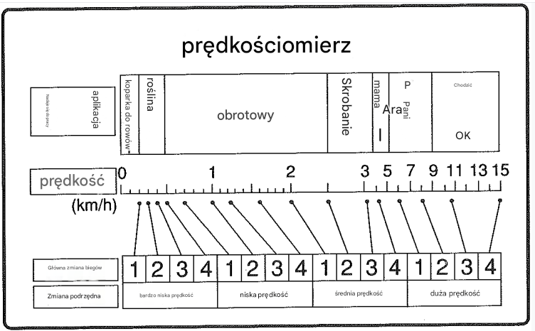

# Praca

## Prędkość jazdy

Wersje vmax = 25 km/h

Wersje vmax = 15 km/h

## Zmiana biegów

Można przełączać pomiędzy biegami tył/przód (rewers) bez wciskania pedału sprzęgła.

Można przełączać biegi główne (przyciskami) bez wciskania pedału sprzęgła.

Biegi główne są sterowane hydraulicznie więc nie można ich zmieniać gdy silnik nie pracuje.

## Asystent skrętu

[Następna strona](./05_praca.md)
